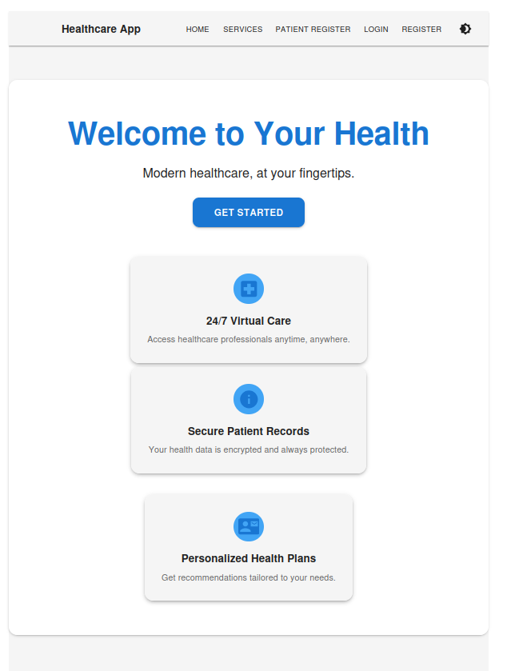
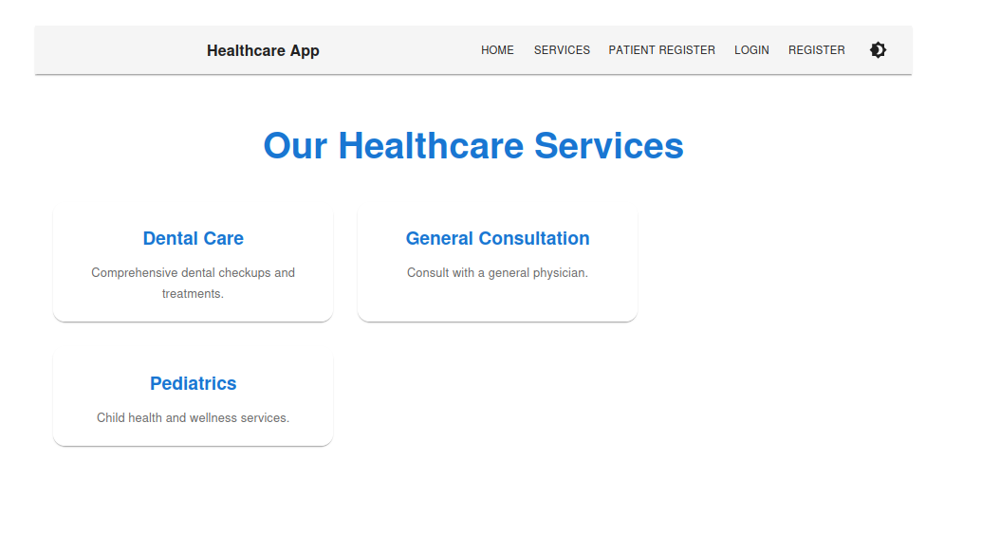
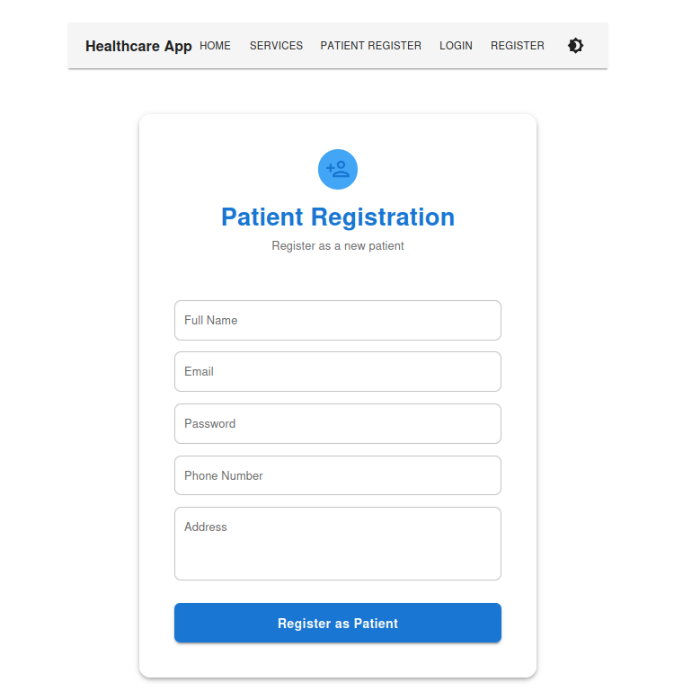
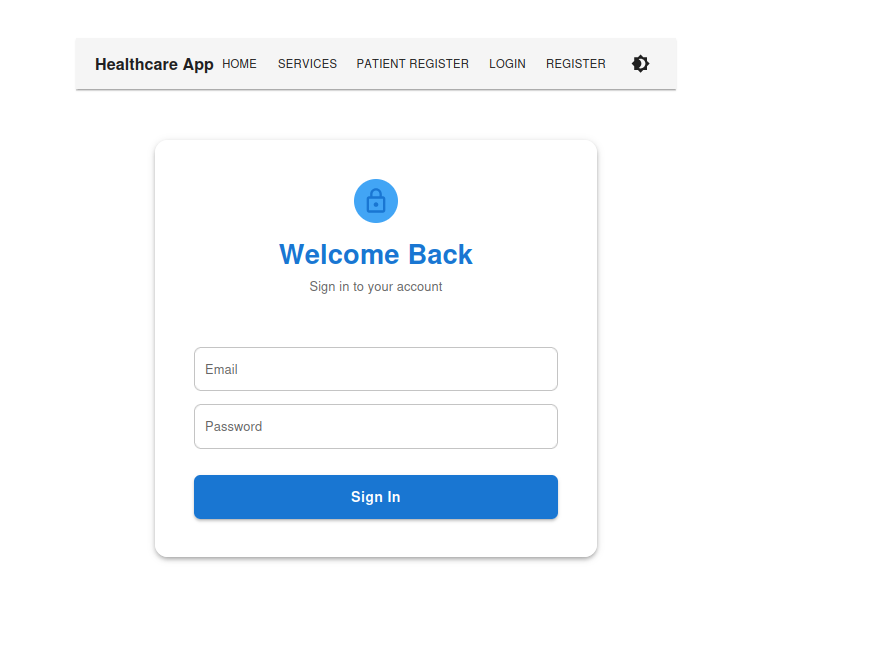
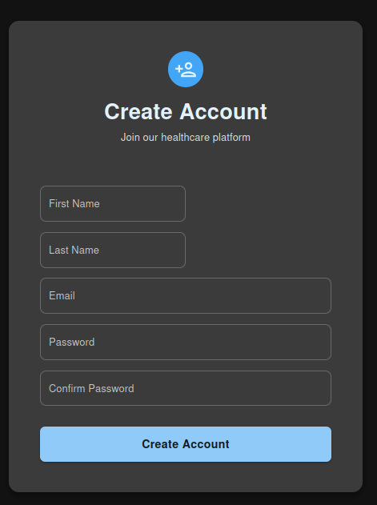

# Healthcare Platform

A modern, full-stack healthcare platform built with Django REST Framework (DRF), PostgreSQL, and a React (TypeScript, Material-UI) frontend.

---

## Requirements

- **Python:** 3.10+
- **Node.js:** 18+
- **npm:** 9+
- **PostgreSQL:** 13+ (or any recent version)
- **Git:** for cloning the repository
- **DBeaver** or **pgAdmin** (optional, for database inspection)

### Backend Python Dependencies (from `requirements.txt`)
- Django==5.2.1
- djangorestframework==3.16.0
- django-cors-headers==4.7.0
- psycopg2-binary==2.9.10
- python-dotenv==1.1.0
- djangorestframework-simplejwt==5.5.0

### Frontend Node.js Dependencies (from `package.json`)
- @mui/material, @mui/icons-material, @emotion/react, @emotion/styled
- react, react-dom, react-router-dom, react-hook-form, axios, @tanstack/react-query
- vite, typescript, eslint, tailwindcss, testing-library (for dev/build)

---

## Setup Checklist

- [ ] Install Python 3.10+ and PostgreSQL
- [ ] Install Node.js 18+ and npm 9+
- [ ] Clone this repository
- [ ] Set up PostgreSQL with the credentials provided below
- [ ] (Optional) Install DBeaver or pgAdmin for database inspection
- [ ] Create and activate a Python virtual environment
- [ ] Install backend dependencies: `pip install -r requirements.txt`
- [ ] Install frontend dependencies: `cd healthcare-frontend-vite && npm install`
- [ ] Run migrations and create a superuser
- [ ] Start backend and frontend servers
- [ ] (Optional) Run tests

---

## Features & Assignment Achievements
- Custom user model with extended fields
- Secure authentication and registration (JWT)
- Public and protected API endpoints
- PostgreSQL integration
- Responsive, modern UI with Material-UI
- Dark mode support
- Animated, interactive landing page
- RESTful API with OpenAPI schema
- Bonus: Animated cards, screenshots, and more!
- Comprehensive documentation

---

## Screenshots

### Landing Page


### Services Page


### Patient Registration


### Login


### Register


---

## Backend/API Endpoints Example

### Apiservices


---

## (Optional) Backend/API Endpoints
If you wish to showcase your backend endpoints (e.g., Django admin, API docs, or a sample endpoint response), add a screenshot to the `images/` folder (e.g., `api-docs.png`) and reference it here:

```markdown

```

---

## Demo Credentials

### Django Admin
- URL: http://localhost:8000/admin/
- Username: damian@gmail.com
- Password: pascal123


### PostgreSQL Database (DBeaver)
- Host: localhost
- Port: 5432
- Database: healthcare-db
- Username: postgres
- Password: mtreat123

---

## API Endpoints
- `POST /api/auth/login/` — Login
- `POST /api/auth/register/` — Register
- `GET /api/services/` — List all services
- `POST /api/patients/` — Register a new patient
- `GET /api/users/me/` — Get current user profile (auth required)
- `GET /api/docs/` — API documentation (Swagger/OpenAPI)

---

## Getting Started

### Backend Setup
1. Clone the repository and navigate to the backend directory.
2. Create and activate a virtual environment:
   ```bash
   python -m venv venv
   source venv/bin/activate
   ```
3. Install dependencies:
   ```bash
   pip install -r requirements.txt
   ```
4. Set up PostgreSQL and update your `.env` or `settings.py` as needed.
5. Run migrations and create a superuser:
   ```bash
   python manage.py migrate
   python manage.py createsuperuser
   ```
6. Start the backend server:
   ```bash
   python manage.py runserver
   ```

### Frontend Setup
1. Navigate to the `healthcare-frontend-vite` directory:
   ```bash
   cd healthcare-frontend-vite
   ```
2. Install dependencies:
   ```bash
   npm install
   ```
3. Start the frontend dev server:
   ```bash
   npm run dev
   ```

---

## API Documentation
- The OpenAPI schema is available at `/openapi-schema.yml`.
- You can view interactive API docs at `/api/docs/` when the backend is running.

---

## Folder Structure
```
/healthcare-frontend-vite
  /src
    /components
    /pages
    /services
    /hooks
    /types
  /images
/backend (Django project)
```

---

## Contribution & License
- Contributions are welcome!
- See LICENSE for details.

---


